# Removal Studio Architecture

## 1. Architectural Overview

Removal Studio is designed from the ground up to operate as a **100% client-side zero-knowledge application**. The entire image processing pipeline—from byte inspection to deep neural network inference and canvas post-processing—executes entirely within the user's browser sandbox.

```mermaid
flowchart TD
    subgraph UserDevice["Client Device Browser Environment"]
        A[User Image Input / Clipboard] --> B[File Signature Sniffer]
        B --> C[Dimension & Decompression Bomb Guard]
        C --> D[Web Worker Orchestrator]
        
        subgraph WorkerEngine["Dedicated Web Worker / ONNX Runtime Web"]
            D --> E{Hardware Check}
            E -->|WebGPU Supported| F[WebGPU Shader Pipeline]
            E -->|Fallback| G[Multi-threaded WASM SIMD]
            F --> H[IS-Net Neural Inference]
            G --> H
            H --> I[Normalized Alpha Probability Matte]
        end
        
        I --> J[Canvas Post-Processing Pipeline]
        
        subgraph PostProcessing["Canvas 2D Pipeline (Full Resolution)"]
            J --> K[Morphological Cavity Filling]
            K --> L[Edge-Aware Smoothing]
            L --> M[Halo Decontamination & Color Bleed Suppression]
            M --> N[Full Resolution Alpha Blending]
        end
        
        N --> O[32-bit Transparent PNG Blob]
        O --> P[Interactive Split-Slider Comparison Viewer]
        O --> Q[Direct Download / OS Clipboard Copy]
    end
```

---

## 2. In-Browser AI Engine

### Model Architecture: IS-Net (Dichotomous Image Segmentation)
- **Model Parameters**: 44M parameters (compact yet dense).
- **Execution Runtime**: `onnxruntime-web` running via WebGPU execution provider or WASM SIMD provider.
- **Quantization**: Shipped in `isnet_fp16` for optimal speed-to-quality ratio (~80MB compressed assets cached in `CacheStorage` / `IndexedDB`).
- **Memory Footprint**: Average active heap footprint during inference is ~180MB, well within the safety limits of desktop and mobile browsers.

### Worker Isolation & Non-Blocking UI
To guarantee 60 FPS UI responsiveness, the ONNX model execution runs inside a dedicated Web Worker. The main thread delegates image buffers through `Transferable Objects` and receives progress callbacks, preventing any frame drops or page freezing.

---

## 3. High-Fidelity Post-Processing Mathematics

### 3.1. Halo Decontamination (Color Bleed Suppression)
When an object is photographed against a bright or dark background, pixels on the boundary are a linear combination:

$$C_{observed} = \alpha C_{foreground} + (1 - \alpha) C_{background}$$

If the background is removed naively, $(1 - \alpha) C_{background}$ creates a visible halo (e.g. white fringe on dark cutout).

Removal Studio applies a color deconvolution algorithm:
1. For every pixel with $15 \le \alpha \le 235$:
2. Inspect an 8-neighborhood kernel for solid foreground donor pixels ($\alpha_{donor} \ge 230$).
3. Compute the mean donor color $\bar{C}_{fg} = \frac{1}{N} \sum C_{donor}$.
4. Blend boundary color towards the donor color proportional to transparency weight:
   $$C_{decontaminated} = C_{observed} \cdot (1 - w) + \bar{C}_{fg} \cdot w \quad \text{where } w = 1 - \frac{\alpha}{255}$$

### 3.2. Edge-Aware Smoothing
To remove step-quantization artifacts without destroying micro hair strands, a localized bilateral smoothing kernel is applied exclusively to transition alpha values:
$$\alpha_{smoothed}(x, y) = \text{round}\left(\frac{4 \alpha(x,y) + \sum_{(dx,dy) \in \mathcal{N}_4} \alpha(x+dx, y+dy)}{8}\right)$$

### 3.3. Morphological Cavity Filling
Solid foreground objects occasionally contain false-negative pinhole drops caused by lighting specularities. A 3×3 majority vote algorithm checks if an isolated pixel is surrounded by $\ge 6$ solid foreground neighbors and fills the cavity.

---

## 4. Full Resolution Preservation

Unlike cloud services that downsample images to 512×512 to save server compute costs, Removal Studio:
1. Resizes input to the model's receptive field for segmentation.
2. Interpolates the resulting alpha matte back to the exact $W_{orig} \times H_{orig}$ dimensions using bicubic interpolation.
3. Applies post-processing directly on the full-resolution pixel buffer.
4. Encodes a pristine 32-bit RGBA PNG matching the exact input resolution.

---

## 5. Security & Browser Sandboxing

- **No Remote Code Execution**: No user input is ever evaluated or deserialized as code.
- **Decompression Bomb Protection**: Input images exceeding 45 Megapixels (~45,000,000 pixels) are rejected client-side before full canvas allocation to protect against browser OOM crashes.
- **COOP / COEP Headers**: `Cross-Origin-Opener-Policy: same-origin` and `Cross-Origin-Embedder-Policy: require-corp` are enabled to permit `SharedArrayBuffer` multithreading safely.
